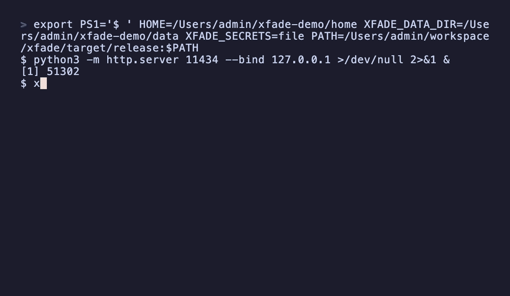

# xfade

[English](README.md) | 简体中文

在 Claude Code / Codex / OpenCode / Pi / Oh My Pi / Aider / Cline / Hermes Agent / OpenClaw 等 AI 编码工具之间切换 API provider，并提供本地代理（OpenAI/Anthropic 兼容端点、failover、协议互转）与 macOS/Linux 常驻 daemon。

CLI（`xfade`）+ Tauri GUI 双形态，Rust 实现。



## 功能

- **TUI**：裸 `xfade` 直接打开 crossfader 风格 TUI——按工具分页签、provider 健康徽章、并行探测全部 provider、行内编辑；非终端环境自动退化为普通列表。
- **Provider 切换**：为 Claude Code / Codex / OpenCode / Pi / Oh My Pi / Aider / Cline / Hermes Agent / OpenClaw 增删改查 provider，一键切换写各自配置（settings.json / config.toml+auth.json / opencode.json / .aider.conf.yml / .cline/data/settings/ / .hermes/config.yaml / .openclaw/openclaw.json），系统钥匙串存 key，切换前自动备份。
- **本地代理**：`xfade serve` 起 OpenAI/Anthropic 兼容端点（`/v1/chat/completions`、`/v1/messages`、`/v1/responses`、`/v1/models`），支持路由 failover、熔断、token 统计、请求日志。
- **协议互转**：Anthropic↔OpenAI 双向转换（`target_protocol`），让客户端与上游协议解耦。
- **daemon（macOS + Linux）**：launchd/systemd 常驻 + 开机自启 + 崩溃重启；`/__xfade/status` 管理端点。
- **GUI**：Tauri 桌面 app，五页（Providers / Proxy / Stats / Logs / Settings）+ 系统托盘（关窗到托盘、快速切换、启停代理），`xfade` 作为 sidecar 自装 daemon。

## 安装

### CLI

```bash
# Homebrew（推荐，macOS）
brew tap xfade-dev/homebrew-xfade
brew install xfade

# 或一行安装（macOS / Linux）
curl -fsSL https://xfade.sh | sh

# 或从 GitHub Release 下载二进制
# 或源码构建
cargo build --release -p xfade   # 产物 target/release/xfade
```

### GUI

从 GitHub Release 下载 `xfade-gui_<version>_aarch64.dmg`（macOS Apple Silicon）拖入 Applications。或源码构建见下方「开发」。

## 快速开始

```bash
# 1. 添加一个第三方 provider（以 Codex 为例）
xfade add kimi --tool codex --base-url https://api.moonshot.cn/v1 --key sk-xxx

# 2. 切换到它（写入 ~/.codex/config.toml + auth.json，自动备份原配置）
xfade use kimi --tool codex

# 3. 查看当前
xfade current --tool codex
```

提示：直接运行 `xfade` 打开交互式 TUI，用方向键 / 推子切换 provider。

Claude Code 支持按 slot 分别指定模型——为 `opus` / `sonnet` / `haiku` 每个 slot
绑定不同模型（写入 `ANTHROPIC_DEFAULT_*_MODEL`）：

```bash
xfade add work --tool claude --base-url https://... --key sk-xxx \
  --opus-model deepseek/deepseek-v4-pro \
  --sonnet-model deepseek/deepseek-v4-flash \
  --haiku-model deepseek/deepseek-v4-flash
```

其余工具同理：`--tool claude-code|codex|open-code|pi|oh-my-pi|aider|cline|hermes|openclaw`。

### 不切配置的一次性运行

`xfade run` 只通过环境变量注入 provider 来启动工具——不写任何配置文件，
现有激活状态保持原样：

```bash
xfade run kimi            # 本次会话用 kimi 启动 claude
xfade run kimi -- --print # `--` 之后的所有参数原样传给工具
```

仅支持 env 驱动的工具（claude、aider）；配置文件型工具会提示改用
`xfade use`。官方 provider 则原样启动工具。

## CLI 命令速查

```
xfade add <id> --tool <t> [--base-url URL] [--key KEY] [--set 'json']
xfade ls [--tool <t>]
xfade use <id> --tool <t>
xfade run <id> [--tool <t>] [-- <args>]  # 环境变量注入一次性启动工具（claude / aider）
xfade current --tool <t>
xfade edit <id> --tool <t> [--base-url URL] [--key KEY] [--set 'json']
xfade rm <id> --tool <t>
xfade presets                     # 列出所有工具的内置预设
xfade import --tool <t>            # 从工具现有配置导入
xfade backup ls|restore --tool <t>
xfade completion <shell>
xfade tui [--tool <t>]             # 交互式 crossfader TUI（默认：裸 `xfade`）
xfade config [set <k> <v>]         # 查看/设置全局配置（secrets 后端、共享 base_url/model/api）
xfade self-update                  # 自更新到最新 GitHub Release
```

### 本地代理

```bash
xfade serve [--port 24860] [--host 127.0.0.1] [--auth-token T]   # 前台运行
xfade proxy use --routes yy,bak [--model-override gpt-x] [--target-protocol chat|messages]
xfade proxy status
xfade proxy clear
xfade stats                  # 按 provider/model 聚合
```

### daemon（macOS + Linux）

```bash
xfade serve install [--port --host --auth-token]   # 安装 launchd 常驻 + 开机自启
xfade serve status                                 # 查询运行/路由/熔断
xfade serve uninstall                              # 卸载
```

日志：`~/.config/xfade/serve.log`。

## GUI

```bash
cd crates/gui && npx tauri dev    # 开发
```

左侧栏五页：

- **Providers**：增删改查/切换/import/备份。
- **Proxy**：控制 daemon（启停）、路由 failover 编辑、熔断状态。
- **Stats**：24h/7d/30d × provider/model 聚合。
- **Logs**：最近 200 条请求日志。
- **Settings**：全局配置（secrets 后端、共享 base_url/model/api、全局 API key）。

系统托盘：关窗到托盘、启动/停止代理、每工具快速切换 provider、退出。GUI 开机自启。GUI 内置 `xfade` sidecar，可自行 `serve install`（无需 CLI 前置安装）。

## 环境契约

- `HOME`：工具配置根。
- `XFADE_DATA_DIR`：自身数据目录（db/backups/daemon.json），缺省 `$HOME/.config/xfade`。
- `XFADE_MOCK_SECRETS=1`：用文件 MockStore 替代系统钥匙串（测试/冒烟）。

CLI 与 GUI 共享同一数据目录与钥匙串，可同时使用。

## 开发

Rust workspace：`crates/core`（库）+ `crates/cli`（`xfade`）+ `crates/gui/src-tauri`（Tauri）。

```bash
cargo test                       # 全量测试
cargo clippy --all-targets --workspace -- -D warnings
cd crates/gui && npm install && npx tauri dev   # GUI 开发（需先构建 sidecar）
bash crates/gui/build-sidecar.sh               # 构建 xfade sidecar 到 binaries/
```

详见 [docs/architecture.md](docs/architecture.md)、[docs/getting-started.md](docs/getting-started.md)、[docs/api.md](docs/api.md)、[CHANGELOG.md](CHANGELOG.md)、[RELEASE.md](RELEASE.md)。

## License

MIT OR Apache-2.0
